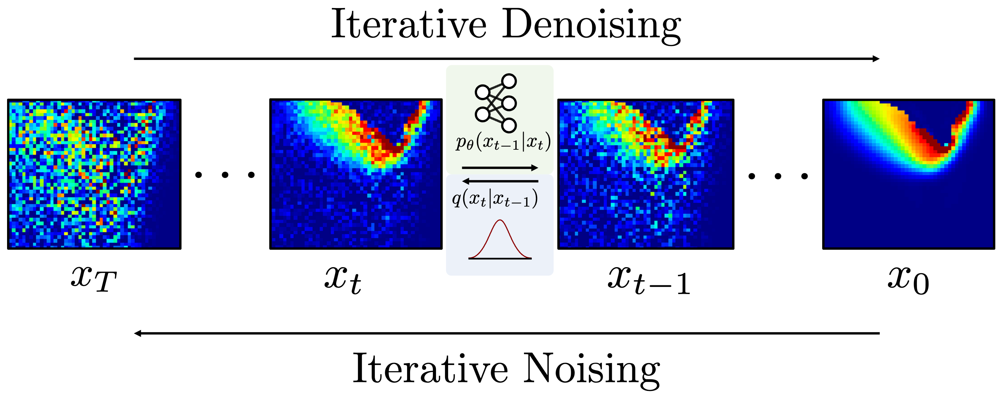

# Inexpensive High Fidelity Melt Pool Models in Additive Manufacturing using Generative Deep Diffusion

This repository is the implementation of ["Inexpensive high fidelity melt pool models in additive manufacturing using generative deep diffusion"](https://doi.org/10.1016/j.matdes.2024.113181), published in *Materials & Design* 245 (2024) 113181. The project uses a conditional denoising diffusion probabilistic model, paired with a Residual-in-Residual Dense Network (RRDN) CNN encoder, to upscale low-fidelity Laser Powder Bed Fusion (L-PBF) simulations of the melt pool to a high-fidelity counterpart. By doing so, the framework bypasses the computational expense of running multiple high-fidelity multi-physics simulations, predicting melt pool depth within 3 μm from input data 4× coarser than the high-fidelity target, and reducing analysis time by two orders of magnitude.



## Dataset
The dataset consists of FLOW-3D single-track bare-plate simulations of SS316L and Ti-6Al-4V at varying laser power and scan velocity. For each case, a coarse low-fidelity simulation is paired with a fine high-fidelity simulation. 295 SS316L simulations are run at 10 μm (HF) and 20 μm (LF) mesh sizes to define the 2× upscaling task, and 40 Ti-6Al-4V simulations are run at 5 μm (HF) and 20 μm (LF) mesh sizes to define the 4× upscaling task. From each transient 3D simulation, a 320 μm × 320 μm 2D cross-section along the laser plane of travel is extracted and centered on the melt pool, capturing the temperature and (optionally) `liqlabel` fields.

The dataset is hosted on Google Drive: <https://drive.google.com/file/d/17pd_nyQ69U8ymIdMuGhOlzXYZDB5iAyo/view?usp=sharing>. To download and unpack automatically:

```bash
bash download_data.sh
```

This saves the extracted folders to `./data/`. The `root_folder` field in the configs under [diffusionsr/configs/](diffusionsr/configs/) should then be pointed at the extracted dataset directory.

## Prerequisites
Install the dependencies listed in [requirements.txt](requirements.txt) with `pip install -r requirements.txt`, then install the package in editable form with `pip install -e .`. We recommend using a fresh conda environment to avoid version clashes ([guide](https://conda.io/projects/conda/en/latest/user-guide/tasks/manage-environments.html)). Training and inference were originally validated on a single NVIDIA RTX-2080 (11 GiB) with CUDA 11.1; the exact package versions used for the paper are preserved in [requirements_paper_exact.txt](requirements_paper_exact.txt) for reference but will not install on newer GPUs or Python ≥ 3.11. Experiment tracking uses Weights & Biases (`wandb`).

## Usage
The workflow first trains the RRDN encoder to map the low-fidelity cross-section to an approximation of the high-fidelity temperature field by minimizing an L1 loss. The encoder weights are then frozen, and the conditional diffusion U-Net is trained to denoise the high-fidelity cross-section conditioned on the encoder output, using a linear variance schedule over 1000 timesteps. At inference time, a Denoising Diffusion Implicit Model (DDIM) sampler reduces the number of denoising steps by up to 50× while preserving reconstruction quality. Evaluation then covers melt pool depth, keyhole depth, keyhole oscillation amplitude, and zero-shot transfer to powder-bed, beam-diameter, and absorptivity modifications.

The modules under [diffusionsr/runners/](diffusionsr/runners/) are imported as libraries (e.g. `from diffusionsr.runners.train_rrdn_encoder import pretrain_encoder`, `from diffusionsr.runners.train_diffusion import DiffusionModel, forwardpass`) and driven from notebooks rather than invoked as standalone scripts. Start with [diffusionsr/notebooks/00_demo.ipynb](diffusionsr/notebooks/00_demo.ipynb) for a worked end-to-end example; the numbered notebooks that follow reproduce the individual figures from the paper.

### Overview
* [diffusionsr/notebooks/](diffusionsr/notebooks/) — [00_demo.ipynb](diffusionsr/notebooks/00_demo.ipynb) (quickstart), [01_reproduce_ss316l_2x.ipynb](diffusionsr/notebooks/01_reproduce_ss316l_2x.ipynb) (SS316L 2× task, Fig 8–11 and Table 2), [02_reproduce_ti64_4x.ipynb](diffusionsr/notebooks/02_reproduce_ti64_4x.ipynb) (Ti-6Al-4V 4× task, Fig 4–6 and Table 1), [03_zero_shot_transfer.ipynb](diffusionsr/notebooks/03_zero_shot_transfer.ipynb) (powder bed, beam diameter, and absorptivity transfer experiments from Appendix B), and [04_keyhole_frequency_analysis.ipynb](diffusionsr/notebooks/04_keyhole_frequency_analysis.ipynb) (keyhole oscillation analysis).

* [diffusionsr/configs/](diffusionsr/configs/) contains YAML experiment configurations specifying the dataset root folder, noise schedule (linear, cosine, sigmoid, or quadratic), normalization, conditioning mode, fields to upscale (temperature and/or `liqlabel`), and optional pretrained encoder checkpoints.

* [diffusionsr/datasets/](diffusionsr/datasets/) contains the `SimulationXZDataset` class and utilities for loading the paired low- and high-fidelity 2D cross-sections, applying cell-wise standardization, downscaling, and data filtering. The preprocessing notebooks that build the paired dataset from raw FLOW-3D output live under [diffusionsr/datasets/preprocessing/](diffusionsr/datasets/preprocessing/).

* [diffusionsr/models/](diffusionsr/models/) contains the neural network architectures: the U-Net used for the conditional denoising process ([diffusion_model.py](diffusionsr/models/diffusion_model.py)), the RRDN-based encoder that produces the conditioning embedding ([lr_encoder_model.py](diffusionsr/models/lr_encoder_model.py)), and a lightweight MobileNet baseline ([mobilenet_model.py](diffusionsr/models/mobilenet_model.py)).

* [diffusionsr/runners/](diffusionsr/runners/) contains the training functions. Encoder pretraining is exposed via `pretrain_encoder` in [train_rrdn_encoder.py](diffusionsr/runners/train_rrdn_encoder.py); the frozen encoder is then consumed by the `DiffusionModel` and training loop in [train_diffusion.py](diffusionsr/runners/train_diffusion.py). Additional modules implement the SRDiff ([train_srdiff.py](diffusionsr/runners/train_srdiff.py)) and MobileNet ([train_mobilenet.py](diffusionsr/runners/train_mobilenet.py)) baselines, and a cross-entropy variant of the encoder ([train_rrdn_encoder_cross_entropy.py](diffusionsr/runners/train_rrdn_encoder_cross_entropy.py)).

* [diffusionsr/analysis/](diffusionsr/analysis/), given a trained model checkpoint, samples upscaled cross-sections and computes the evaluation metrics reported in the paper. [sampling.py](diffusionsr/analysis/sampling.py) implements the beta schedules and the `predict_streamlined_ddim_diffusion` DDIM loop. [analysis_functions.py](diffusionsr/analysis/analysis_functions.py) implements the melt-pool and keyhole profile extraction (`get_profile`), checkpoint loaders (`load_diffusion`, `load_encoder`, `initialize_diffusion`), and per-model prediction wrappers that drive the MP-MAE and VC-MAE metrics. [metrics.py](diffusionsr/analysis/metrics.py) provides auxiliary image-quality metrics (`PSNR`, `SSIM`), and [plotting_functions.py](diffusionsr/analysis/plotting_functions.py) produces the figures.

## Citation
If you use this code or dataset in your research, please cite:

```bibtex
@article{ogoke2024inexpensive,
  title={Inexpensive high fidelity melt pool models in additive manufacturing using generative deep diffusion},
  author={Ogoke, Francis and Liu, Quanliang and Ajenifujah, Olabode and Myers, Alexander and Quirarte, Guadalupe and Malen, Jonathan and Beuth, Jack and Barati Farimani, Amir},
  journal={Materials \& Design},
  volume={245},
  pages={113181},
  year={2024},
  publisher={Elsevier},
  doi={10.1016/j.matdes.2024.113181}
}
```
